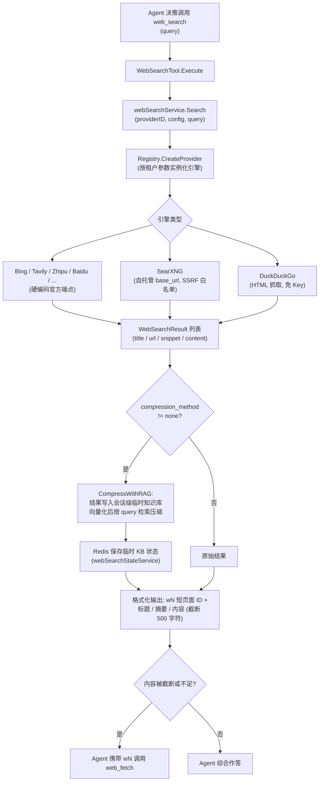

# 网络搜索与网页抓取

当知识库检索不足以回答问题时，WeKnora 的 Agent 可以借助 `web_search`（联网搜索）与 `web_fetch`（网页抓取 + LLM 分析）两个工具获取实时信息。底层实现分布在 `internal/infrastructure/web_search`（搜索引擎适配层）、`internal/infrastructure/web_fetch`（轻量抓取器）与 `internal/agent/tools`（Agent 工具层），并通过 `docker/searxng` 提供可选的自托管元搜索引擎。

## 接口抽象

搜索能力由两层接口定义（`internal/types/interfaces/web_search.go`）：

```go
// WebSearchProvider defines the interface for web search providers
type WebSearchProvider interface {
    Name() string
    Search(ctx context.Context, query string, maxResults int, includeDate bool) ([]*types.WebSearchResult, error)
}

// WebSearchService defines the interface for web search services
type WebSearchService interface {
    Search(ctx context.Context, providerID string, config *types.WebSearchConfig, query string) ([]*types.WebSearchResult, error)
    CompressWithRAG(ctx context.Context, sessionID string, tempKBID string, questions []string, ...) (...)
}
```

`internal/infrastructure/web_search/registry.go` 维护 **provider 类型 -> 工厂函数** 的注册表，实例按租户参数在调用时创建：

```go
type ProviderFactory func(params types.WebSearchProviderParameters) (interfaces.WebSearchProvider, error)

func (r *Registry) Register(id string, factory ProviderFactory)
func (r *Registry) CreateProvider(providerType string, params types.WebSearchProviderParameters) (interfaces.WebSearchProvider, error)
```

## 支持的搜索引擎

引擎在 `internal/container/container.go` 中注册：

```go
registry.Register("duckduckgo", infra_web_search.NewDuckDuckGoProvider)
registry.Register("google", infra_web_search.NewGoogleProvider)
registry.Register("bing", infra_web_search.NewBingProvider)
registry.Register("tavily", infra_web_search.NewTavilyProvider)
registry.Register("ollama", infra_web_search.NewOllamaProvider)
registry.Register("baidu", infra_web_search.NewBaiduProvider)
registry.Register("searxng", infra_web_search.NewSearxngProvider)
registry.Register("keenable", infra_web_search.NewKeenableProvider)
registry.Register("zhipu", infra_web_search.NewZhipuProvider)
```

| 引擎 | 源码文件 | 是否需要 API Key | 端点 | 备注 |
|------|---------|-----------------|------|------|
| DuckDuckGo | `duckduckgo.go` | 否 | HTML 抓取优先，API 兜底 | 免费；可配 `proxy_url` |
| Google | `google.go` | 是（还需 `engine_id`） | Google Custom Search API（官方 SDK `customsearch/v1`） | |
| Bing | `bing.go` | 是 | `https://api.bing.microsoft.com/v7.0/search`（硬编码） | |
| Tavily | `tavily.go` | 是 | `https://api.tavily.com/search`（硬编码） | |
| Ollama Web Search | `ollama.go` | 是 | `https://ollama.com/api/web_search`（硬编码） | 最多 10 条结果 |
| 百度千帆 AI 搜索 | `baidu.go` | 是 | `https://qianfan.baidubce.com/v2/ai_search/web_search`（硬编码） | |
| SearXNG | `searxng.go` | 否 | 租户自填 `base_url`（自托管实例） | 唯一允许自定义地址的引擎，需过 SSRF 校验 |
| Keenable | `keenable.go` | 可选 | `https://api.keenable.ai`（硬编码） | 无 Key 走公共限速端点，有 Key 解除限制 |
| 智谱搜索 | `zhipu.go` | 是 | `https://open.bigmodel.cn/api/paas/v4/web_search`（硬编码），默认引擎 `search_std` | |

除 SearXNG 外，所有引擎端点均硬编码、租户不可配置——这是防 SSRF 的第一道措施（源码注释：`Not configurable by tenants — prevents SSRF`）。

## 搜索引擎配置（Provider 实体）

每个工作空间可以创建多个搜索引擎配置实例（如 "Production Bing"、"Test Google"），存储为 `web_search_providers` 表的 `WebSearchProviderEntity`（`internal/types/web_search_provider.go`），Agent 按 ID 引用。参数结构 `WebSearchProviderParameters`：

| 名称 | 类型 | 默认值 | 说明 |
|------|------|--------|------|
| `api_key` | string | 空 | 搜索服务密钥，AES-GCM 加密落库；仅通过 `/credentials` 子资源修改，响应中从不返回 |
| `engine_id` | string | 空 | 仅 Google Custom Search 需要 |
| `base_url` | string | 空 | 仅 SearXNG：自托管实例地址；经 `utils.ValidateURLForSSRF` 校验，内网地址须加入 `SSRF_WHITELIST` |
| `proxy_url` | string | 空 | 可选出站 HTTP/HTTPS 代理（仅隧道流量，不替换 API 端点），同样过 SSRF 校验 |
| `extra_config` | map[string]string | nil | 预留扩展 |

CRUD 路由（`RegisterWebSearchProviderRoutes`，`internal/router/router.go`）：`/web-search-providers` 下的增删改查、`POST /test`（用存量凭证探测外部服务，Admin 权限）、`POST /:id/test`、`PUT /:id/credentials`；另有 `GET /web-search/providers` 返回可用引擎类型目录。

## 出站请求的 SSRF 防护

`internal/infrastructure/web_search/proxy.go` 的 `NewSearchHTTPClient` 为所有引擎构造统一的安全 HTTP 客户端：

- `DialContext` 使用 `utils.SSRFSafeDialContext`（拨号时校验目标 IP，防 DNS rebinding）；
- 重定向逐跳经 `ssrfSafeRedirect` 复验 `ValidateURLForSSRF`，超过最大跳数直接失败；
- 显式 `proxy_url` 需通过 SSRF 校验，未配置时回落 `ProxyFromEnvironment`。

## 搜索工具调用流程

Agent 工具 `web_search`（`internal/agent/tools/web_search.go`）遵循 "KB First" 规则（必须先做 `grep_chunks` + `knowledge_search`），其执行链路：



要点（均见 `web_search.go`）：

- **RAG 压缩**：`CompressWithRAG` 把搜索结果注入一个隐藏的会话级临时知识库（UI 不展示，用后可清理），用向量检索抽取与 query 相关的片段，避免把整页塞进上下文；临时 KB 的 `tempKBID / seenURLs / knowledgeIDs` 状态经 `WebSearchStateService` 持久化在 Redis，会话内多次搜索复用、不重复索引。
- 结果 URL 以 **wN 短 ID** 呈现给模型，`web_fetch` 用同一 ID 取回完整页面。
- provider 由 Agent 配置解析出的 `providerID` 决定，空则回落租户默认。

## 网页抓取（web_fetch）

### Agent 工具：按需获取网页证据

Agent 模式启用 `web_search_enabled` 后注册 `web_search` 与 `web_fetch`；`web_fetch_enabled` / `web_fetch_top_n` 控制普通问答流水线自动抓取重排结果，不是 Agent 工具的总开关。

`WebFetchTool` 接收 `{items: [{url: "wN", prompt}]}`。运行时解析页面引用，按规范化 URL 去重，再逐页获取内容。成功页面在其他页面失败时仍可使用。

生产 `NewFetcher` 使用带 URL、DNS 固定和逐跳重定向校验的 HTTP transport。当前不启用内置 Chromium：单纯安装浏览器或设置 DNS host mapping 不能保证其所有子请求遵守同一出站访问边界。纯 JavaScript 页面可能无法读取，应明确说明证据不足。

抓取后的处理：
- 原始响应最多 2 MiB，读取上限加一以检测超限；超限返回不可重试的 `body_too_large`，不把不完整 HTML 前缀当作正文。
- `text/plain` / `text/markdown` 原样保留；较长 HTML 复用已有 go-readability 提取主内容，无有效正文时保留 HTML 清洗结果。
- 不超过 12,000 个 Unicode 字符的页面直接交给主 Agent，不额外摘要。长页面沿用按问题摘要，摘要失败时原文仍可用。
- 模型上下文层继续执行证据预算和截断标记。

每个页面返回 `success` / `failed` / `skipped`、错误码和可重试标记。全部抓取失败时，回答可以使用已有搜索摘要，但必须说明没有验证网页正文。

超时保持 Agent 60 秒、普通问答流水线 15 秒。GitHub `blob` URL 转换为原始文件 URL。长页面摘要调用继续记录 `purpose=web_fetch_summary`。

平台无需为原生 `web_fetch` 配置另一个 API Key。Firecrawl / Crawl4AI 不是现成的后端配置项；接入须通过抓取接口适配，并单独验证服务出站权限、正文质量和延迟。

## docker/searxng 的角色

SearXNG 是自托管的元搜索引擎（聚合上游多个引擎），WeKnora 把它作为**免 API Key 的默认可选搜索后端**打包在 `docker-compose.yml` 的 `searxng` / `full` profile 中：

- `docker/searxng/settings.yml`：关键定制包括 `search.formats` 开启 `json`（WeKnora 后端走 `/search?format=json`）、`server.limiter: false`（关闭 IP 限流，否则后端会被节流；若公开部署需重新开启并配置放行名单）、`secret_key` 由入口脚本以 `SEARXNG_SECRET` 环境变量替换。
- `searxng-init` 辅助容器先把模板复制进独立 volume，避免 SearXNG 入口脚本原地 sed 修改把解析后的密钥写回仓库工作区。
- 应用容器默认把 `searxng` 主机名并入 SSRF 白名单：`SSRF_WHITELIST_EXTRA=searxng,qdrant,...`，因此租户配置 `base_url: http://searxng:8080` 开箱即用。
- 客户端超时 12s（`defaultSearxngTimeout`），略高于 SearXNG 的 `outgoing.max_request_timeout: 10.0`，让上游慢引擎表现为 SearXNG 侧错误而非客户端取消。`ValidateSearxngBaseURL` 在"保存"与"使用"两处共享，保证配置校验一致。

## 如何新增一个搜索引擎

1. 在 `internal/infrastructure/web_search/` 新建 `<engine>.go`，实现 `interfaces.WebSearchProvider`（`Name()` + `Search()`），并提供工厂函数 `func New<Engine>Provider(params types.WebSearchProviderParameters) (interfaces.WebSearchProvider, error)`；官方端点应硬编码为常量，HTTP 客户端用 `NewSearchHTTPClient(timeout, params.ProxyURL)` 构造。
2. 在 `internal/types/web_search_provider.go` 增加 `WebSearchProviderType` 常量。
3. 在 `internal/container/container.go` 的注册处追加 `registry.Register("<engine>", infra_web_search.New<Engine>Provider)`。
4. 如需密钥/额外参数校验，在 web search provider service 的参数校验分支中补充（参考 `ValidateSearxngBaseURL` 的共享校验模式），并为前端 `GET /web-search/providers` 目录补充展示信息。
5. 参考 `searxng_test.go` / `zhipu_test.go` 用 `httptest` 模拟上游编写单测。
